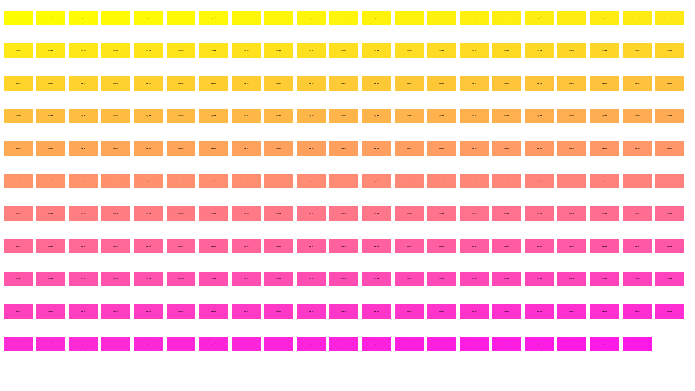

# Logo Wall Generator 🧱🖼️

Generate a clean, padded 1920×1080 logo wall from assorted image files — perfect for associations, events, and sponsor showcases.

## Features

- 🖼️ Fixed output size: 1920x1080
- 🧩 Automatically arranges logos in a grid with padding
- 📂 Supports `.png`, `.jpg`, `.jpeg`, `.webp`, and `.svg` formats
- 🧭 Logos sorted alphabetically by filename
- 🧼 Preserves logo aspect ratios with white padding background
- 🔁 Easy to update — just change files in the `logos/` folder and rerun

## Installation

### Step 1: Set up a virtual environment (recommended)

```bash
cd path/to/logo-wall-generator
python3 -m venv venv
source venv/bin/activate
```

### Step 2: Install Python dependencies

```bash
pip install pillow cairosvg
```

> On macOS, you may also need these system libraries if SVGs fail:
```bash
brew install cairo pango gdk-pixbuf libffi
```

## Usage

### First-time setup
1. Add your logo files into `logos/` (supports `.png`, `.jpg`, `.jpeg`, `.webp`, `.svg`).
2. Activate the virtual environment (see above).
3. Run the script:

```bash
python logo_wall_generator.py
```

The output will be saved as `logo_wall.png` in the same directory.

### After setup (future runs)

```bash
cd path/to/logo-wall-generator
source venv/bin/activate
python logo_wall_generator.py
```

## Example Output

Here’s a preview of a generated logo wall:



## Customization

You can tweak the following parameters in the script:

- `CANVAS_WIDTH` / `CANVAS_HEIGHT` — size of the output image
- `PADDING` — spacing between logos
- `BACKGROUND_COLOR` — RGB tuple (default is white)

## TODO

- create snap and brew packages
	- create a launcher that opens the logo folder and guides trough the process
- add option for background image

## License

This project is licensed under the **GNU GPL v3**.  
See the [LICENSE](LICENSE) file for details.
